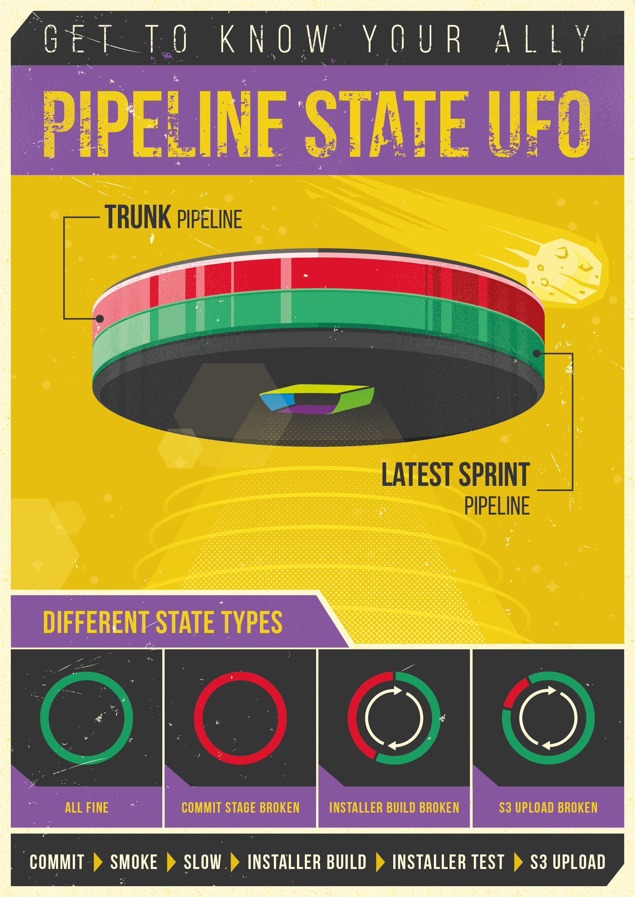

# UFO
###Visual alert and status display for e.g. build, CI, continuous delivery, operations, and more 

* [__story__](story) The original UFO has been created by Helmut, Dynatrace Chief Software Architect. Read his story.  
* [__howto__](howto) Step by step description on building your own UFO
* [__partlist__](partlist/readme.md#ufo-partlist)
(folder must use this name for Arduino IDE to automatically upload to ESP8266)
* [__3dprint__](3dprint) folder contains all CAD files plus derivative 3D print files
* [__ufo.ino__](ufo.ino) is the Arduino IDE main program: requires Arduino IDE 1.6.7+ plus additional modules. see ufo.ino source file for more details about requirements
* [__data__](data) folder contains all files that will be loaded into the ESP8266 flash memory SPIFF drive to contain website data 
* [__nodejs testserver__](nodejs testserver) contains source files to simulate the ESP8266 webserver for testing purposes; requires nodejs server + static-server module
 

###Example use-case at Dynatrace Ruxit
Cares about visualizing the actual continuous delivery pipeline, from developers commit to the build system, all the way to deployments into staging systems. The UFO visualizes two pipeline stages, and for each it uses different color/animation coding to represent state and severity.

