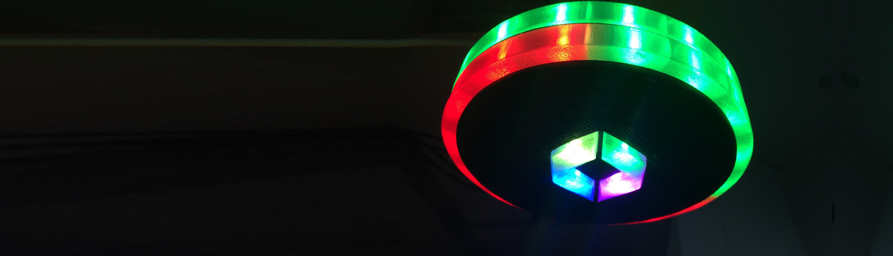

# UFO
###Visual alert/status display for builds, CI, continuous delivery, operations, and more 

* [__Story__](story) The original UFO was created by Helmut, Dynatrace Chief Software Architect. Read his story.  
* [__How to__](howto) Step-by-step instructions for building your own UFO
* [__Parts list__](partlist/readme.md#ufo-partlist)
(folder must use this name for Arduino IDE to automatically upload to ESP8266)
* [__3D printing__](3dprint) folder contains all CAD files plus derivative 3D print files
* [__UFO.ino__](ufo.ino) is the Arduino IDE main program: requires Arduino IDE 1.6.7+ plus additional modules. see ufo.ino source file for more details about requirements
* [__Data__](data) folder contains all files that will be loaded into the ESP8266 flash memory SPIFF drive to contain website data 
* [__Node.js test server__](nodejs testserver) contains source files to simulate the ESP8266 webserver for testing purposes; requires Node.js server + static-server module
 

###Example use case at Dynatrace Ruxit
The UFO visualizes the actual continuous delivery pipeline, from developers commit to the build system, all the way to deployments into staging systems. The UFO visualizes two pipeline stages, and for each it uses different color/animation coding to represent states and severity. Of course you can assign your own meanings to the visualization and even customize the UFO and APIs to your needs.

