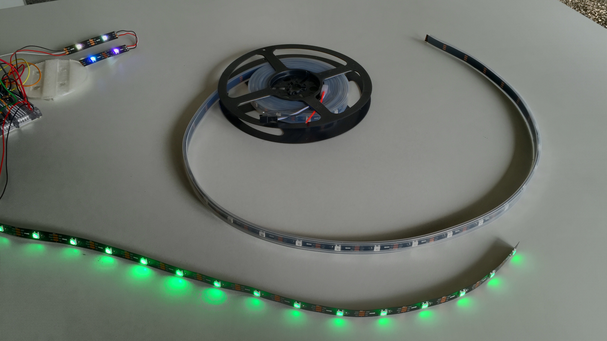

#Instructions to build the Dynatrace UFO

see also [partlist](../partlist)

##Print the 10 pieces in 5 batches

####We printed with following settings:
* NO supports
* 3 shells
* 0.2mm layer height (0.1mm layer worked well too)
* 20% infill

####1. UFO case base + microcontroller holder, plus microcontroller clip

black filament

####2. UFO case top + cable stabilizer + mini-switch-clip

black filament

####3. separator ring

black filament

####4. Downlight inlay + first ring

transparent filament

####5. Second ring

transparent filament

##Prepare USB cable
Chop off one end of the USB cable and use the 5V line (red) and ground (black) wire for powering the LED strips as well as the Huzzah ESP8266 microcontroller. Make sure to isolate the other wires so to make sure we wont damage USB source or get in contact with the other electronics.

##Prepare LED strips
Cut the LED strip in pieces of 2 strips with 15 LEDs each and 2 strips with 2 LEDs each. Please make sure you cut exactly in the middle of the soldering tabs, because you will need to solder cables later there. Check out the cutting mark.

##Solder short strips
Solder the short strips in a series accordingly to the data-flow direction. There are arrows on the strip that show you the direction. Data for controlling the bus of LEDs flows from the microcontroller outbound in direction of arrow.

!(2x2 LEDs in series on logo.jpg)

##Wiring
USB cables 5V power goes to "VBat" and the black ground cable goes to "GND"

The white DATA wires that control the LEDs are soldered as follows:
* pin 4 - lower LED ring
* pin 5 - upper LED ring
* pin 2 - downlight LEDs

The blue Wifi reset cables:
* pin 15 - mini-button-switch for WiFi reset, to turn the UFO into Access Point mode; triggers when 3V are on pin 15
* pin 3V (next to pin 15) - goes to the other contact of the mini-button-switch. 

 
Note that the LEDs need to be powered directly from the USB cable, and not from the 3V pin. So all the red 5V cables and separately all the black ground cables are soldered together.

##Putting all together
The Huzzah ESP8266 microcontroller is mounted on top of the downlight inlay and also keeps the 2 short LED strips in their position. For proper isolation, put the printed platform with the 4 pins upside under the Huzzah board and put then all that inside the clip that holds everything in place.

##Firmware
FTDI cable
Upload through serial (needed the first time; later firmware can be uploaded through the Web UI).

###Upload firmware available on github
1. TODO - flash tool and bin files

###Build the firmware yourself
1. Install Arduino IDE 1.6.7 and in preferences dialog this board manager URL: `http://arduino.esp8266.com/stable/package_esp8266com_index.json`
2. [compile and upload firmware through serial](https://learn.adafruit.com/adafruit-huzzah-esp8266-breakout/using-arduino-ide)
3. Upload the Website files to the SPIFFS filesystem. There are two variants to do this:
 * option 1: Upload the all files (*.html, *.css, font.*, ...) that are contained in the `data` folder through the Web UI using the firmware upload form. those files will be automatically put on the ESP8266 file system.
 * option 2: Upload the entire content set of the data folder through an Arduino IDE plug-in via the serial interface. See this description: 
[upload file system and web site](https://github.com/esp8266/Arduino/blob/master/doc/filesystem.md#uploading-files-to-file-system) (SPIFFS)

##Configure the UFO
1. Once firmware is uploaded to the UFO, it starts an access point with SSID named "ufo". (if you cannot see the "ufo" SSID, click the WiFi reset button) - the UFO alternates a single blue ring
2. Connect to the "ufo" Wifi and navigate to http://192.168.4.1 - once connected the UFO blinks with a second blue ring

3. Configure WiFi settings so that the UFO connects to your WiFi (note, enterprise PEAP authentication is not yet available) - whenever the UFO is trying to connect to your WiFi, the UFO blinks yellow. So you can declare connection success when the yellow stopped blinking.
NOTE: in case you have troubles using the Web UI for setting the WiFi config, you might have more success using the api directly:
`http://192.168.4.1/api?ssid=<ssid>&pwd=<pwd>`
4. Access the Web UI of the UFO as well as the REST interface /api    ***TODO FOR MORE***

##Todo
* implement the original UFO api calls also on ESP8266
* publish the Dynatrace Application Monitoring and Ruxit API infos, DCRUM and Synthetic to follow
* slight improvement on the base, to allow sliding the ring onto the base with LEDs already mounted
* publish pre-compiled binaries and instructions to use the flashing tool
* update web UI to implement desired use-cases  

