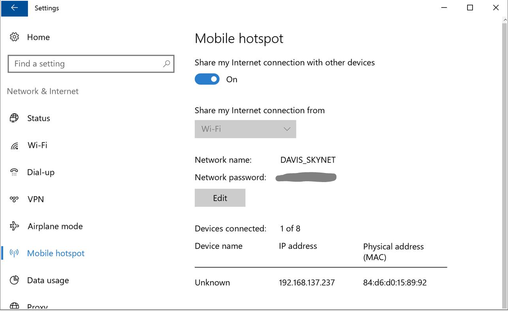
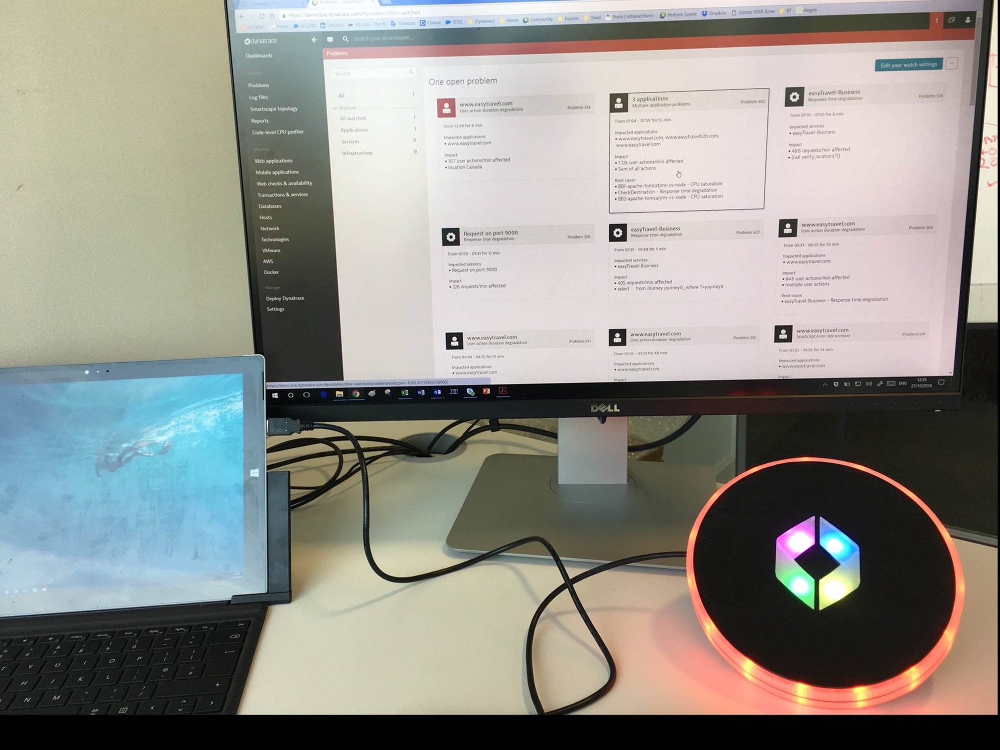

#UFO Quickstart

##Power Supply

Connect the UFO to a 2000mA USB charging adapter. 
e.g. the iPad or Windows Surface charger should work fine, but check the specs beforehand. 
Note that the UFO draws more current than standard USB can provide. 
Please be warned!    

##Check Firmware Version

This description is for firmware versions dated after 25th of October 2016. 
If you have older firmware, please follow the firmware updated procedures in the howto guide.

##Configure Wifi
1. As default and when clicking the hardware reset button at the top of the UFO, 
the UFO starts a Wifi access point with an SSID named "ufo". 
(if you cannot see the "ufo" SSID, click the wifi reset button) - 
the UFO alternates a single blue ring
2. Connect a Web browser enabled device (laptop, tablet, smartphone) 
to the UFO's Wifi with the SSID "ufo" and navigate to http://192.168.4.1 - 
Once connected the UFO blinks with a second blue ring

3. Configure UFO wifi settings so that the UFO connects to your wifi 
(Note: WPA2 works well, but enterprise WPA2 and PEAP authentication is not yet available) - 
whenever the UFO is trying to connect to your wifi, the UFO blinks yellow. 
So you can declare connection success when the yellow stops blinking.
Note: If you have troubles using the web UI for setting the wifi config, 
you might have more success using the REST API directly:
`http://192.168.4.1/api?ssid=<ssid>&pwd=<pwd>`

Tip: To test and play with the ufo despite enterprise wifi, 
or in situations that require a wifi login, you can use following workaround: 
e.g. Windows 10 (anniversary update) mobile hotspot feature or connect it your mobile devices hotspot capability.

1. The UFO will reboot after you configured its Wifi and start to blink 
yellow while trying to connect and show color encoded IP address when connected. 
At that point you might be able to connect to it with `http://ufo` 
as the UFO registers with a default hostname of "UFO" 
with the DHCP server. 

If that doesnt work you will need to use `http://<ipaddress>`.

There are multiple ways to discover the IP address of the Dynatrace UFO
in case you need it:
  1. Option: the UFO is displaying the address color coded until you access 
  it the first time. 
  The lower ring visualizes the current IP address digit by digit. 
  192.168... will light 1 led then 9 (shown as 5+4 LEDs) then 2 and so on. 
  A dot is visualized as 3 white leds. 
  The individual digits are separated by a short white flash. 
  The IP is visualized over and over again until the first api rest 
  call is issued. To stay in sync every IP address visualization 
  run uses a different color.
  1. Option: In case you used Windows 10 hotspot, 
  you will find the IP address right there.
  1. Option: lookup the MAC address in your Wifi Access Point 
 and get the IP address assigned by DHCP. 

##Integration with Dynatrace SaaS

The Dynatrace UFO polls the Dynatrace SaaS problem status using HTTPS. 
For that you need to create in the Dynatrace SaaS user interface 
an access token. (and please don't try to use the token in the screenshot,
its of course an invalid one).

Dynatrace SaaS default integration shows currently following color codes 
* green: no open problem
* all red: 1 open problem affecting end users
* all purple: 1 open problem affecting services
* all blue: 1 open problem affecting infrastructure only
* 2 or 3 red segments rotating: 
2, 3 or more opten problems affecting end users
* 2 or 3 red purple rotating: 
1 open problem affecting services. 
* 2 or 3 red blue rotating: 
1 open problem affecting infrastructure only
* mixtures of above, where use impact where severity is in the order of 
user impact, services, infrastructure

This is how it looks when it is connected and showing a problem:

##Integration with Dynatrace Managed

Coming soon. This will use webhooks. 
Please use the Generic REST interface for now.

##Integration with Dynatrace AppMon

Coming soon. Please use the Generic REST interface for now.

##Generic REST Integration

UFO communication examples (REST calls)

`/api?top_init=1&top=0|3|FF0000&top_bg=00FF00`

`/api?top_init=1&top=0|1|FFC000|1|3|FF0000|4|1|FFC000&top_bg=00A00a&top_whirl=220`

`/api?bottom_init=1&bottom=0|15|FF0000&bottom_bg=0000FF&bottom_morph=500|6`
